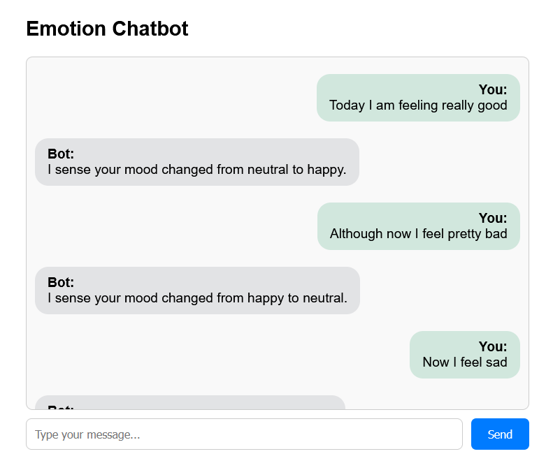

# AI-Powered Sentiment Chatbot

A conversational web chatbot that detects the emotional tone of user messages using Natural Language Processing (NLP). Built with Python (Flask, spaCy, VADER Sentiment) and a simple HTML/JavaScript frontend.

---

##  Features

- Emotion detection using hybrid NLP:
  - VADER sentiment analysis (positive / negative / neutral)
  - Custom keyword-based detection (anger, fear, disgust, surprise)
- Flask web API with JSON responses
- Web UI with clean chat interface and bubble-style layout
- Minimal in-memory context tracking (remembers last detected emotion in the conversation)
- Simple chat logging to a JSONL file


##  Tech Stack

- **Backend**: Python 3, Flask
- **NLP**: spaCy (en_core_web_sm), VADER Sentiment
- **Frontend**: HTML, CSS, JavaScript

---
##  Screenshots


---

## 🚀 Setup & Installation

### 1️⃣ Clone the repository

```bash
git clone https://github.com/DKGProgrammer/Sentiment-Chat-Bot.git
cd sentiment-chat-bot

pip install flask spacy vaderSentiment
python -m spacy download en_core_web_sm